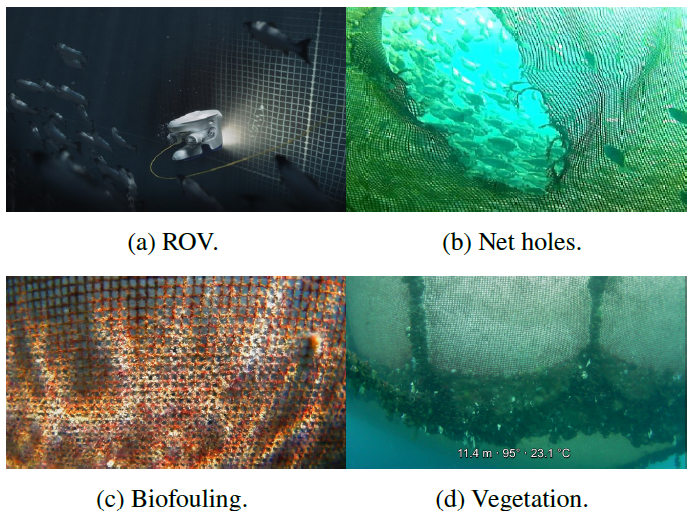
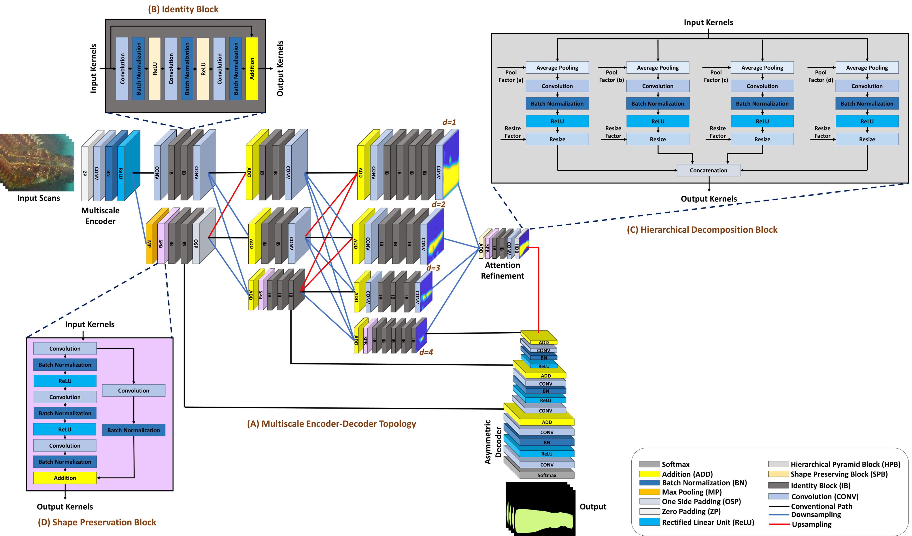

# Aquaculture Defects Recognition via Multi-Scale Semantic Segmentation

Semantic segmentation framework to detect **biofouling**, **vegetation**, and **net holes** on aquaculture net pens using underwater imagery.  
It implements a **multi-scale encoder–decoder** with three custom blocks—**Identity Block (IB)**, **Shape-Preservation Block (SPB)**, and **Hierarchical Decomposition Block (HDB)**—and a tailored **L_t** loss that blends two sub-objectives to handle class imbalance and stabilize convergence.

> 

> This repository accompanies the paper *Akram, W., Hassan, T., Toubar, H., Ahmed, M., Miškovic, N., Seneviratne, L., & Hussain, I. (2024). Aquaculture defects recognition via multi-scale semantic segmentation*. Expert systems with applications, 237, 121197.

---

## ✨ Highlights

- **Multi-scale encoder–decoder**: fuses features from *multiple encoder depths* (“butterfly” topology) to be robust to noise and preserve defect shape.
- **Custom blocks**:
  - **IB** (residual-style) → discriminative features while preserving geometry
  - **SPB** → keeps the *shape* of defect regions
  - **HDB** → fuses coarse↔fine representations across scales
- **L_t loss** (with weights β₁, β₂ and temperature τ) → soft targets for stable learning under heavy background/foreground imbalance.
- **Validated on four datasets** with real fish-farm imagery:
  - **LABUST** (156,600 imgs): biofouling, vegetation
  - **KU** (37,926 imgs): vegetation, holes
  - **NDv1** (1,864 imgs): biofouling, vegetation
  - **NDv2** (1,411 imgs): biofouling, vegetation
- **Outperforms SOTA** on mAP across all four datasets (e.g., +6.58% on LABUST).

---

## 📚 Datasets

| Dataset | Images | Biofouling | Vegetation | Holes | Notes |
|---|---:|:---:|:---:|:---:|---|
| LABUST | 156,600 | ✓ | ✓ | ✗ | Real fish farms (Cromaris, Croatia) |
| KU | 37,926 | ✗ | ✓ | ✓ | Khalifa University pool; strong disturbances |
| NDv1 | 1,864 | ✓ | ✓ | ✗ | Public (Roboflow); pixel-wise masks prepared by authors |
| NDv2 | 1,411 | ✓ | ✓ | ✗ | Public (Roboflow); pixel-wise masks prepared by authors |

> The paper reports pixel-wise annotations for NDv1/NDv2 and new releases of LABUST/KU dataset.

---

## 🏗️ Architecture (at a glance)

- Encoder aggregates multi-resolution features; latent features are taken from **multiple depths** rather than only the top.
- **HDB** blends features with average pooling + conv + BN + ReLU across scales; **SPB** preserves geometry with residual fusion; **IB** follows a ResNet-style pattern.
- Decoder is asymmetric and upsamples via **strided convolutions** (not bilinear interpolation) for sharper masks.

> See Fig. 2 in the paper for the full diagram.
> 

---

## 🧪 Reported Training Setup (from paper)

- **Environment**: Python 3.7.9, TensorFlow 2.1.0, CUDA 11.0, cuDNN 7.5
- **Optimizer**: ADADELTA (lr=1.00, ρ/decay=0.95)
- **Schedule**: 40 epochs, 512 iterations per epoch
- **Input size**: 576×768×3
- **Validation**: LABUST/KU use 20% of train for val; NDv1/NDv2 use official splits (363 val)

---

##  Results

